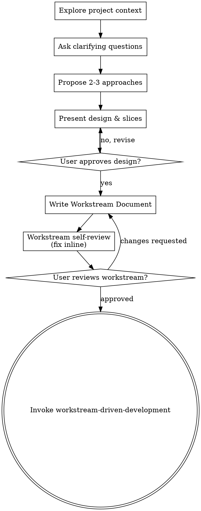

# Workstream Brainstorming

Help turn ideas into fully formed designs and sequential execution slices through natural collaborative dialogue, culminating in a single **Workstream Document**.

Start by understanding the current project context, then ask questions one at a time to refine the idea. Once you understand what you're building, present the design and get user approval.

<HARD-GATE>
Do NOT invoke any implementation skill, write any code, scaffold any project, or take any implementation action until you have presented a design/workstream and the user has approved it. This applies to EVERY project regardless of perceived simplicity.
</HARD-GATE>

## Anti-Pattern: "This Is Too Simple To Need A Design"

Every project goes through this process. A todo list, a single-function utility, a config change — all of them. "Simple" projects are where unexamined assumptions cause the most wasted work. The design can be short (a few sentences for truly simple projects), but you MUST present it and get approval.

## The Workstream Document Concept

We explicitly do NOT split design and implementation planning into separate documents. Instead, we capture both in a single **Workstream Document** written under `docs/workstreams/YYYY-MM-DD-<topic>.md`.

A Workstream Document contains:

1. **Metadata**: Title, Date, Status (Planned/In Progress/Complete), Objective, Target Branch.
2. **Context**: Problem description, Approved simplifications, Target behavior, Deliberate simplifications, Architecture invariants.
3. **Scope**: In scope, Out of scope.
4. **Key Files**: Table mapping file paths, packages, and their roles.
5. **Scoped Slices**: Sequential slices (Slice A, B, C...) containing Goals, TDD-structured Tasks, Watch outs, Verification steps, Manual smoke test guidelines, and Carry-forwards.
6. **Final Verification**: Comprehensive validation checklist (compilation, typecheck, tests, lint, format).
7. **Success Criteria**: Clear, testable outcomes that must be met.

This document serves as the single source of truth for both architectural design and the task checklist used by `workstream-driven-development`.

## Checklist

You MUST create a task for each of these items and complete them in order:

1. **Explore project context** — check files, docs, recent commits
2. **Ask clarifying questions** — one at a time, understand purpose/constraints/success criteria
3. **Propose 2-3 approaches** — with trade-offs and your recommendation
4. **Present design and slice breakdown** — in sections scaled to their complexity, get user approval after each section
5. **Write Workstream Document** — save to `docs/workstreams/YYYY-MM-DD-<topic>.md` and commit
6. **Workstream self-review** — check for placeholders, contradictions, completeness, and make sure slices are independently logical; dispatch `workstream-document-reviewer-prompt.md` if you want a reviewer pass before user review
7. **User reviews Workstream Document** — ask user to review the workstream file before proceeding
8. **Transition to implementation** — invoke `workstream-driven-development` skill

## Process Flow



**The terminal state is invoking workstream-driven-development.** Do NOT invoke `writing-plans` or standard implementation skills.

## The Process

**Understanding the idea:**

- Check out the current project state first (files, docs, recent commits).
- Before asking detailed questions, assess scope: if the request describes multiple independent subsystems, flag this immediately. Don't spend questions refining details of a project that needs decomposition first.
- If the project is too large for a single Workstream Document, help the user decompose it into sub-projects: what are the independent pieces, how do they relate, and what order should they be built? Then brainstorm the first sub-project through the normal design flow. Each sub-project gets its own Workstream Document → implementation cycle.
- Ask clarifying questions one at a time to refine the idea, focusing on purpose, constraints, and success criteria.

**Exploring approaches:**

- Propose 2-3 different approaches with trade-offs, leading with your recommended option and explaining why.

**Presenting the design & slice breakdown:**

- Once you understand what you're building, present the design.
- Scale each section to its complexity: cover architecture, components, data flow, testing.
- **Decompose into slices**: Break down the execution plan into sequential, logical groupings of tasks (Slice A, Slice B, Slice C...). Slices must represent clean milestones that can be independently developed, compiled, and tested.
- **Structure tasks for TDD**: Each slice should make the red → green → broader verification flow explicit. Do not leave testing as an afterthought or a vague final bullet.

**Working in existing codebases:**

- Explore the current structure before proposing changes. Follow existing patterns.
- Where existing code has problems that affect the work (e.g., a file that's grown too large, unclear boundaries, tangled responsibilities), include targeted improvements as part of the design — the way a good developer improves code they're working in.
- Don't propose unrelated refactoring. Stay focused on what serves the current goal.

**Slice sizing principles:**

- Slices are executed by low-cost models with limited context windows. Each slice must be small enough for a lightweight agent to implement without being overwhelmed.
- A well-sized slice typically touches 1-5 files and can be described in a few task bullet points without needing code snippets.
- Each task group should be small enough to carry its own TDD loop: write the failing test, verify the failure, implement the minimum change, verify the pass, then run broader slice verification.
- If a slice requires extensive explanation to be unambiguous, it is too large — split it.
- The workstream document intentionally contains no implementation code or pseudo-code. Key file paths, API contracts, database column names, schema definitions, test targets, and exact verification commands are encouraged when needed to eliminate ambiguity, but raw code generation is offloaded entirely to the implementer. This means task descriptions must be precise enough to implement without being pseudo-code themselves.

**Decision completeness:**

- By the time the workstream document is finished, all design decisions that could require rework if chosen wrong MUST be resolved. If there are two or more valid ways to implement a task, and picking the wrong one would require rework — resolve it in the document. Pick one and state it explicitly.
- The only decisions left to the implementer should be ones where any reasonable pick works fine (e.g., variable naming, internal helper decomposition, log message wording).
- If you notice ambiguity during slice authoring where "there are two ways to do this," ask: would choosing wrong cause rework? If yes, resolve it now.

## Document Structure & Schema

Use this exact structure for the Workstream Document written to `docs/workstreams/YYYY-MM-DD-<topic>.md`:

````markdown
# <Topic> Workstream

**Date**: YYYY-MM-DD
**Status**: Planned / In Progress / Complete
**Merged**: Target branch (e.g. `dev` or `main`)
**Objective**: Clear, concise statement of the ultimate goal.

## Context

### Problem
What is currently wrong, inefficient, or missing?

### Approved simplification
What constraints have been agreed upon to simplify the task and avoid over-engineering?

### Target behaviour
How should the system behave once the workstream is finished?

### Deliberate simplification for this workstream
What is explicitly deferred, out of scope, or accepted as a limitation for this workstream?

### Architecture invariant
What are the strict design, folder, or boundary rules that must never be violated?

---

## Workstream scope

**In scope**
- Bullet 1
- Bullet 2

**Out of scope**
- Bullet 1
- Bullet 2

---

## Key files

| File | Package | Current role |
| ---- | ------- | ------------ |
| `path/to/file` | Name or `@pkg` | Brief description of its role in this workstream |

---

## Scoped workstream slices

### Slice A: <Slice Title>

**Goal**: What does this slice achieve?

#### Tasks

**`file/to/modify`**
- [ ] Write the failing test for the exact behavior this slice introduces or changes
- [ ] Run the focused test command and verify the failure for the expected reason
- [ ] Implement the minimum production change required for that behavior
- [ ] Run the focused test again and verify it passes
- [ ] Commit the slice changes once the focused behavior and slice verification are green

#### Watch out
- Caveats, risks, or API constraints

#### Verification
- Commands to run and assertions to check (use the project's actual test/build tooling)

#### Manual smoke test
- Setup / preconditions the user needs before testing
- Explicit user actions to perform
- Expected visible or behavioral outcome to confirm

#### Carry-forward
- State, APIs, or schema elements established in this slice that the next slice assumes to be present.

*(Repeat for Slice B, Slice C, etc.)*

---

## Final verification

Run all of the following before handoff. Each must pass clean:
- [ ] Tests pass
- [ ] Type check passes
- [ ] Linter passes
- [ ] Formatter passes

---

## Success criteria

All criteria met:
- [ ] Specific behavior 1
- [ ] Specific behavior 2
````

## Self-Review and Approval

After writing the workstream document, look at it with fresh eyes. If helpful, dispatch the reviewer template in `workstream-document-reviewer-prompt.md` before asking the user to review the document.

1. **Placeholder scan:** Any "TBD", "TODO", or vague requirements? Fix them.
2. **Slice sizing:** Could a low-cost model with limited context implement each slice from these task descriptions alone? If a slice is too large or requires too much background, split it.
3. **Decision completeness:** Are there any points where multiple valid approaches exist? For each, ask: would choosing wrong cause rework? If yes, resolve it here — the implementer should only face choices where any reasonable pick works fine.
4. **Slice logical flow:** Does Slice B properly build on Slice A's carry-forward?
5. **No implementation code in the document:** Tasks describe WHAT to do, not HOW in production code. Name the behavior under test, test file/target, and exact commands when useful, but do not paste implementation snippets or pseudo-code.
6. **Manual smoke test quality:** Does every slice include a concrete manual smoke test with setup/preconditions, explicit user actions, and expected outcomes? If not, add it.

Ask the user to review the written Workstream Document:

> "Workstream Document written and committed to `docs/workstreams/YYYY-MM-DD-<topic>.md`. Please review it and let me know if you want to make any changes before we transition to `workstream-driven-development`."

Wait for approval. Once approved, invoke `workstream-driven-development` to execute.
