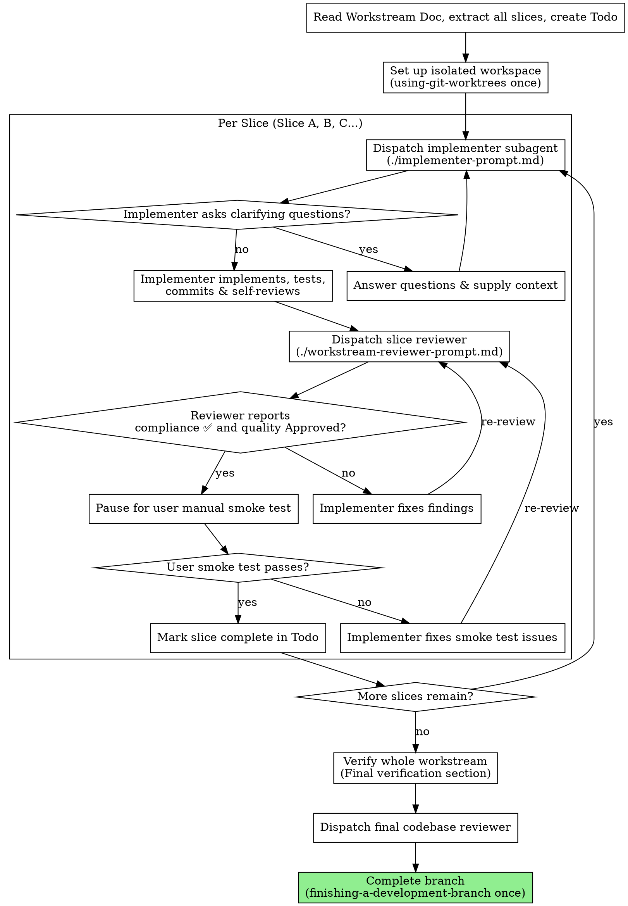

# Workstream-Driven Development

Execute a Workstream Document by dispatching a fresh subagent per slice, with a combined review after each: one reviewer returns both a compliance verdict and a quality verdict.

**Why subagents:** You delegate slice-level execution to specialized agents with isolated contexts. By precisely crafting their instructions, task details, and relevant file contexts, you ensure they stay focused and succeed. They should never inherit your full session history—only the curated slice requirements and file definitions.

**Core principles:**

1. **Single Git Worktree**: The entire workstream is executed within a single, isolated git worktree folder. We use the `using-git-worktrees` skill ONCE at the start of the workstream, and `finishing-a-development-branch` ONCE after the final slice is fully verified and completed. We do NOT create separate worktrees for each slice.
2. **Sequential Slice Execution**: Slices (Slice A, B, C...) are completed one by one in order.
3. **Curated Input**: The controller (you) extracts the slice goal, tasks, watch-outs, verification, manual smoke test steps, and carry-forward from the Workstream Document, presenting a highly focused prompt to the implementer subagent.
4. **Combined Review**: For every slice, one reviewer checks both requirements compliance and code quality in a single pass, returning separate verdicts for each.
5. **Pause After Review Pass**: Preserve the implementer ↔ reviewer retry loop until review passes. Only after the reviewer reports both compliance ✅ and quality Approved do you pause for the user's manual smoke test for that slice.

## When to Use

Use this skill when you have an approved **Workstream Document** (e.g., in `docs/workstreams/YYYY-MM-DD-<topic>.md`) and are ready to begin implementation.

## The Process

## Prompt Templates

The following prompt templates and helper scripts are stored in this skill's directory and MUST be used when dispatching subagents:

- `implementer-prompt.md` - Used to run the implementation subagent for the current slice.
- `workstream-reviewer-prompt.md` - Used to run the combined slice reviewer (compliance + quality in one pass).
- `scripts/slice-brief` - Extracts a single slice into a file for implementer handoff.
- `scripts/review-package` - Creates the diff package used by reviewers.

## Required Sub-skills

Implementer subagents MUST be configured to use:

- `solopowers:test-driven-development` - Mandatory for every slice. The implementer must follow a real red → green cycle and provide evidence for it in the slice report.

## Roles and Model Selection

- **Controller (You)**: Oversees execution, manages the slice-to-slice state, updates the Todo task list, curates file contexts, and coordinates reviews. (Most capable model).
- **Implementer**: Focuses entirely on implementing and testing a single slice. (Fast, cheap model for mechanical/isolated tasks; standard model for complex integrations).
- **Slice Reviewer**: Evaluates requirements compliance AND code quality in a single pass. Returns separate verdicts: spec compliance (✅/❌/⚠️) and slice quality (Approved/Needs fixes). (Capable standard or premium model — this role covers both compliance and quality, so it carries more judgment load than either role did alone).

Always specify the model explicitly when dispatching a subagent. An omitted model silently inherits the controller's session model, which is often more expensive than needed.

**Task complexity signals:**

- Touches 1-2 files with a complete slice description → cheap model
- Touches multiple files with integration concerns → standard model
- Requires design judgment, broad codebase understanding, or final review synthesis → most capable model

**Turn count beats token price.** Wall-clock and context cost scale with how many turns a subagent takes, and the cheapest models routinely take 2-3× the turns on multi-step work — costing more overall. Use a mid-tier model as the floor for reviewers and for implementers working from prose descriptions. When the slice brief contains the complete code to write, the implementation is transcription plus testing: use the cheapest tier for that implementer. Single-file mechanical fixes also take the cheapest tier.

## Handling Implementer Status

Implementer subagents report one of four statuses. Handle each appropriately:

**DONE:** Generate the review package (`scripts/review-package BASE HEAD <workspace-slug>`, from this skill's directory — it prints the unique file path it wrote; BASE is the commit you recorded before dispatching the implementer — never `HEAD~1`, which silently drops all but the last commit of a multi-commit slice), then dispatch the slice reviewer with the printed path. The reviewer returns both a compliance verdict and a quality verdict in a single pass.

**DONE_WITH_CONCERNS:** The implementer completed the work but flagged doubts. Read the concerns before proceeding. If the concerns are about correctness or scope, address them before review. If they're observations (e.g., "this file is getting large"), note them and proceed to review.

**NEEDS_CONTEXT:** The implementer needs information that wasn't provided. Provide the missing context and re-dispatch.

**BLOCKED:** The implementer cannot complete the slice. Assess the blocker:

1. If it's a context problem, provide more context and re-dispatch with the same model
2. If the slice requires more reasoning, re-dispatch with a more capable model
3. If the slice is too large, break it into smaller pieces
4. If the workstream document itself is wrong, escalate to the human

**Never** ignore an escalation or force the same model to retry without changes. If the implementer said it's stuck, something needs to change.

## Execution Details

### 1. Initial Set Up (Start of Workstream)

- Use the `using-git-worktrees` skill to verify/create an isolated git worktree for the entire workstream.
- Read the Workstream Document at `docs/workstreams/YYYY-MM-DD-<topic>.md` and extract all slices.
- Derive the workspace slug from the Workstream Document filename: strip directory path, `.md` extension, and leading `YYYY-MM-DD-` date prefix (e.g., `2026-06-20-previous-uploads-panel.md` → `previous-uploads-panel`). Record this slug — every script invocation needs it.
- Before dispatching Slice A, scan the workstream once for conflicts, oversized slices, or requirements that contradict architecture invariants. Raise those with the user before implementation instead of discovering them mid-slice.
- Create a `todo` task list with one task per slice, plus a final task for "Final verification and close branch".
- Check for a durable progress ledger at `$(scripts/wsd-workspace <workspace-slug>)/progress.md` before resuming or dispatching any slice. If the ledger already marks a slice complete, do not re-dispatch it.

### 2. Dispatching the Implementer

For each slice, dispatch the implementer subagent. Prefer file handoffs over pasted text:

- Generate a slice brief with `scripts/slice-brief WORKSTREAM_FILE SLICE_LETTER` and pass the printed file path to the implementer.
- Explicitly inject `solopowers:test-driven-development` into the implementer dispatch. Do not rely on ambient skill discovery or a vague mention of testing.
- Provide the Workstream Objective, in-scope details, and any carry-forward context the brief cannot know.
- Name a report file for the implementer so detailed implementation notes and test evidence live on disk, not in controller context.
- Provide only the relevant existing code files or interfaces for this slice (do NOT provide files unrelated to the slice).

**Context budget:** Implementers run on low-cost models. The curated prompt must fit comfortably in a small context window. If a slice's brief + carry-forward + relevant files exceed what a lightweight model can hold, escalate to the user — the slice is too large and needs splitting in the Workstream Document.

### 3. Reviewing the Slice

- Once the implementer reports `DONE` or `DONE_WITH_CONCERNS`, generate a diff package with `scripts/review-package BASE HEAD <workspace-slug>` and dispatch the `workstream-reviewer`. The reviewer checks the diff and reported TDD/test evidence to verify every task inside the slice is met (nothing missed, nothing extra), the red → green cycle actually happened, the code is well-built (readable, tested, maintainable, follows project conventions), and the manual smoke test is supported.
- The reviewer returns two verdicts in one report: spec compliance (✅/❌/⚠️) and slice quality (Approved/Needs fixes).
- If the reviewer reports a requirement they cannot verify from the diff alone (⚠️ Cannot verify from diff), resolve it yourself from the workstream context before marking the slice complete. If it is a real gap, send it back as a failed review.
- If the reviewer flags issues, have the implementer fix them and re-review. Do NOT manually fix reviewer-flagged issues yourself. If the original implementer is unavailable, aggregate all findings into a single fix dispatch rather than spawning one fixer per issue.
- If the reviewer flags a defect that the workstream explicitly mandates, treat it as a human decision: present the finding and the workstream text to the user instead of silently overriding either one.
- **Manual Smoke Test Pause**: Only after the reviewer reports both compliance ✅ and quality Approved, pause and ask the user to run the slice's manual smoke test from the Workstream Document. Do not continue to the next slice until the user confirms the smoke test passed.
- If the user reports a smoke test issue, send it back to the implementer and then re-review before asking for the manual smoke test again.

### 4. Transitioning and Finalization

- When all slices are marked complete, run the commands listed in the **Final verification** section of the Workstream Document.
- Dispatch the final codebase reviewer with a review package covering the whole workstream branch.
- Invoke the `finishing-a-development-branch` skill to guide the user through local merging, opening a PR, or branch cleanup.

## File Handoffs

Everything you paste into a dispatch prompt — and everything a subagent prints back — stays resident in your context for the rest of the session. Prefer artifacts on disk:

- **Slice brief:** Use `scripts/slice-brief WORKSTREAM_FILE SLICE_LETTER` to extract one slice into its own file. The script auto-derives the workspace slug from the workstream filename.
- **Implementer report:** Give each slice a report file path. The implementer writes the full report and test evidence there, then returns only status, commits, a one-line test summary, concerns, and the report path.
- **Reviewer inputs:** The slice reviewer receives the slice brief path, implementer report path, and diff package path.
- **Review package:** Use `scripts/review-package BASE HEAD <workspace-slug>` so the reviewer reads one artifact containing commit list, stat summary, and diff context.

## Constructing Reviewer Prompts

Per-slice reviews are slice-scoped gates. The broad review happens once, at the final whole-workstream review. When you fill the reviewer template:

- Do not add open-ended directives like "check all uses" or "run race tests if useful" without a concrete, slice-specific reason
- Do not ask a reviewer to re-run tests the implementer already ran on the same code — the implementer's report carries the test evidence
- Do not pre-judge findings for the reviewer — never instruct a reviewer to ignore or not flag a specific issue. If you believe a finding would be a false positive, let the reviewer raise it and adjudicate it in the review loop. If the prompt you are writing contains "do not flag," "don't treat X as a defect," "at most Minor," or "the workstream chose" — stop: you are pre-judging, usually to spare yourself a review loop.
- The global-constraints block you hand the reviewer is its attention lens. Copy the binding requirements verbatim from the Workstream Document's Slice header (watch-outs, requirements, architecture invariants). The reviewer's template already carries the process rules (YAGNI, test hygiene, review method) — the constraints block is for what THIS slice's spec demands.
- Hand the reviewer its diff as a file: run this skill's `scripts/review-package BASE HEAD <workspace-slug>` and pass the reviewer the file path it prints. The output never enters your own context, and the reviewer sees the commit list, stat summary, and full diff with context in one Read call. Use the BASE you recorded before dispatching the implementer — never `HEAD~1`, which silently truncates multi-commit slices.
- A dispatch prompt describes one slice, not the session's history. Do not paste accumulated prior-slice summaries into later dispatches — a real session's dispatch hit 42k chars of which 99% was pasted history. A fresh subagent needs its slice, the interfaces it touches, and the global constraints. Nothing else.
- Dispatch fix subagents for Critical and Important findings. Record Minor findings in the progress ledger as you go, and point the final whole-workstream review at that list so it can triage which must be fixed before merge. A roll-up nobody reads is a silent discard.
- A finding labeled workstream-mandated — or any finding that conflicts with what the Workstream Document's text requires — is the human's decision, like any workstream contradiction: present the finding and the workstream text, ask which governs. Do not dismiss the finding because the workstream mandates it, and do not dispatch a fix that contradicts the workstream without asking.
- The final whole-workstream review gets a package too: run `scripts/review-package $(git merge-base main HEAD) HEAD <workspace-slug>` and include the printed path in the final review dispatch, so the final reviewer reads one file instead of re-deriving the branch diff with git commands.
- Every fix dispatch carries the implementer contract: the fix subagent re-runs the tests covering its change and reports the results. Name the covering test files in the dispatch — a one-line fix does not need the whole suite. Before re-dispatching the reviewer, confirm the fix report contains the covering tests, the command run, and the output; dispatch the re-review once all three are present.
- If the final whole-workstream review returns findings, dispatch ONE fix subagent with the complete findings list — not one fixer per finding. Per-finding fixers each rebuild context and re-run suites; a real session's final-review fix wave cost more than all its slices combined.

## Durable Progress

Conversation memory does not survive compaction. Track durable slice progress in `$(scripts/wsd-workspace <workspace-slug>)/progress.md`, not only in todos.

The ledger file lives inside the per-workstream workspace directory (`.solopowers/wsd/<slug>/`), so successive workstreams never collide.

- At skill start, check the ledger before dispatching any slice.
- When a slice passes review and the user confirms the manual smoke test, append one line such as `Slice A: complete (commits <base7>..<head7>, review clean, smoke test passed)`.
- On resume, trust the ledger and git log over memory.

## Red Flags / Anti-patterns

- **Creating a new worktree per slice**: Absolutely NOT. Keep everything in one worktree.
- **Letting subagents read the Workstream Doc**: Subagents should NOT read the Workstream Doc. Provide the curated text and tasks for their specific slice to protect their context window.
- **Treating TDD as optional**: Do not dispatch implementers without `solopowers:test-driven-development`, and do not accept "tests added later" as equivalent to a real red → green cycle.
- **Proceeding while a slice review fails**: Never start the next slice while there are open review findings in the current slice.
- **Skipping the manual smoke test pause**: Never continue to the next slice once review passes without pausing for the user's manual smoke test.
- **Failing to commit**: Ensure each slice is committed before starting reviews, and any fixes are also committed.

## Session Resume

If the session ends mid-workstream (context limit, user interruption, crash), the resume point is defined by:

1. **The durable progress ledger**: Which slices are marked complete vs. pending in `$(scripts/wsd-workspace <workspace-slug>)/progress.md`.
2. **The last committed slice**: The git log in the worktree confirms what was finished.
3. **The Workstream Document checkboxes**: Task checkboxes (`- [x]`) reflect completed work inline.
4. **The Todo task list**: Helpful, but not authoritative after compaction.

**On resume:**

- Read the durable progress ledger first.
- Read the Workstream Document and check which task checkboxes are marked done.
- Check git log in the worktree to confirm the last committed slice.
- Resume from the first incomplete slice. Do not re-run completed slices.
- Carry-forward context from the last completed slice still applies.
