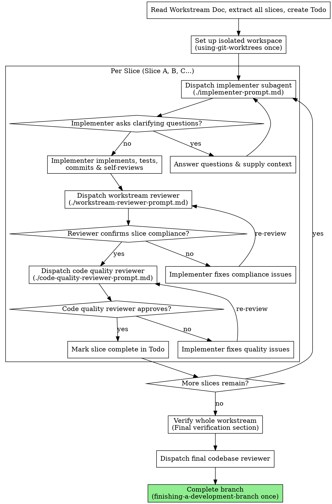

# Workstream-Driven Development

Execute a Workstream Document by dispatching a fresh subagent per slice, with a two-stage review after each: workstream compliance review first, then code quality review.

**Why subagents:** You delegate slice-level execution to specialized agents with isolated contexts. By precisely crafting their instructions, task details, and relevant file contexts, you ensure they stay focused and succeed. They should never inherit your full session history—only the curated slice requirements and file definitions.

**Core principles:**
1. **Single Git Worktree**: The entire workstream is executed within a single, isolated git worktree folder. We use the `using-git-worktrees` skill ONCE at the start of the workstream, and `finishing-a-development-branch` ONCE after the final slice is fully verified and completed. We do NOT create separate worktrees for each slice.
2. **Sequential Slice Execution**: Slices (Slice A, B, C...) are completed one by one in order.
3. **Curated Input**: The controller (you) extracts the slice goal, tasks, watch-outs, verification, and carry-forward from the Workstream Document, presenting a highly focused prompt to the implementer subagent.
4. **Two-Stage Review**: For every slice, we run a Workstream Compliance Review, then a Code Quality Review.
5. **Continuous Execution**: Do not pause to ask "should I continue?" between slices unless blocked. Proceed diligently from Slice A to the final slice.

## When to Use

Use this skill when you have an approved **Workstream Document** (e.g., in `docs/workstreams/YYYY-MM-DD-<topic>.md`) and are ready to begin implementation.

## The Process

## Prompt Templates

The following prompt templates are stored in this skill's directory and MUST be used when dispatching subagents:
- `implementer-prompt.md` - Used to run the implementation subagent for the current slice.
- `workstream-reviewer-prompt.md` - Used to run the compliance reviewer against the slice tasks, watch-outs, and goals.
- `code-quality-reviewer-prompt.md` - Used to run the code quality reviewer.

## Roles and Model Selection

- **Controller (You)**: Oversees execution, manages the slice-to-slice state, updates the Todo task list, curates file contexts, and coordinates reviews. (Most capable model).
- **Implementer**: Focuses entirely on implementing and testing a single slice. (Fast, cheap model for mechanical/isolated tasks; standard model for complex integrations).
- **Workstream Reviewer**: Focuses on verification that requirements are met and nothing extra was added. (Capable standard or premium model).
- **Code Quality Reviewer**: Evaluates style, testing rigor, performance, and structure. (Capable standard or premium model).

## Execution Details

### 1. Initial Set Up (Start of Workstream)
- Use the `using-git-worktrees` skill to verify/create an isolated git worktree for the entire workstream.
- Read the Workstream Document at `docs/workstreams/YYYY-MM-DD-<topic>.md` and extract all slices.
- Create a `todo` task list with one task per slice, plus a final task for "Final verification and close branch".

### 2. Dispatching the Implementer
For each slice, dispatch the implementer subagent. Provide:
- The Workstream Objective and In-Scope details.
- The Current Slice Goal, Tasks, Watch-Outs, and Verification instructions.
- Relevant existing code files (do NOT provide files unrelated to the slice).
- Any carry-forward context from prior slices.

**Context budget:** Implementers run on low-cost models. The curated prompt must fit comfortably in a small context window. If a slice's tasks + carry-forward + relevant files exceed what a lightweight model can hold, escalate to the user — the slice is too large and needs splitting in the Workstream Document.

### 3. Reviewing the Slice
- **Stage 1 (Workstream Compliance)**: Once the implementer reports `DONE` or `DONE_WITH_CONCERNS`, dispatch the `workstream-reviewer`. The reviewer checks the code diff and actual behavior to verify every task inside the slice is perfectly met, nothing was missed, and no unrequested features were built.
- **Stage 2 (Code Quality)**: Dispatch the `code-quality-reviewer`. They check readability, test coverage, maintainability, project conventions, and code organization.
- If any reviewer flags an issue, have the implementer subagent fix it and re-review. Do NOT manually fix reviewer-flagged issues yourself.

### 4. Transitioning and Finalization
- When all slices are marked complete, run the commands listed in the **Final verification** section of the Workstream Document.
- Invoke the `finishing-a-development-branch` skill to guide the user through local merging, opening a PR, or branch cleanup.

## Red Flags / Anti-patterns

- **Creating a new worktree per slice**: Absolutely NOT. Keep everything in one worktree.
- **Letting subagents read the Workstream Doc**: Subagents should NOT read the Workstream Doc. Provide the curated text and tasks for their specific slice to protect their context window.
- **Proceeding while a slice review fails**: Never start the next slice while there are open compliance or quality issues in the current slice.
- **Failing to commit**: Ensure each slice is committed before starting reviews, and any fixes are also committed.

## Session Resume

If the session ends mid-workstream (context limit, user interruption, crash), the resume point is defined by:

1. **The Todo task list**: Which slices are marked complete vs. pending.
2. **The last committed slice**: The git log in the worktree shows exactly what was finished.
3. **The Workstream Document checkboxes**: Task checkboxes (`- [x]`) reflect completed work inline.

**On resume:**
- Read the Workstream Document and check which task checkboxes are marked done.
- Check git log in the worktree to confirm the last committed slice.
- Resume from the first incomplete slice. Do not re-run completed slices.
- Carry-forward context from the last completed slice still applies.
