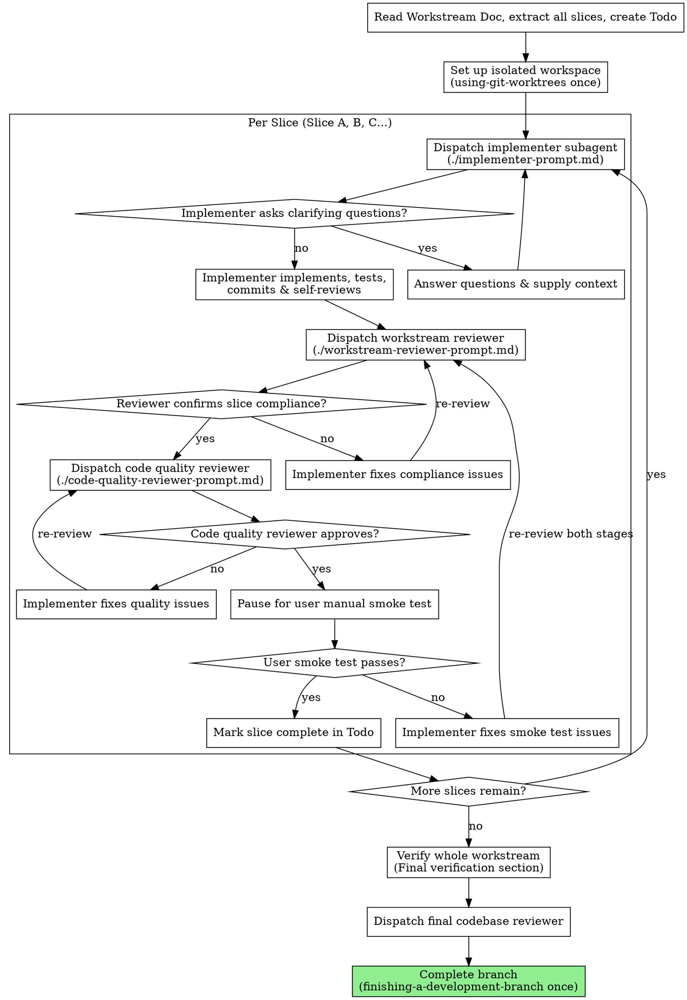

# Workstream-Driven Development

Execute a Workstream Document by dispatching a fresh subagent per slice, with a two-stage review after each: workstream compliance review first, then code quality review.

**Why subagents:** You delegate slice-level execution to specialized agents with isolated contexts. By precisely crafting their instructions, task details, and relevant file contexts, you ensure they stay focused and succeed. They should never inherit your full session history—only the curated slice requirements and file definitions.

**Core principles:**

1. **Single Git Worktree**: The entire workstream is executed within a single, isolated git worktree folder. We use the `using-git-worktrees` skill ONCE at the start of the workstream, and `finishing-a-development-branch` ONCE after the final slice is fully verified and completed. We do NOT create separate worktrees for each slice.
2. **Sequential Slice Execution**: Slices (Slice A, B, C...) are completed one by one in order.
3. **Curated Input**: The controller (you) extracts the slice goal, tasks, watch-outs, verification, manual smoke test steps, and carry-forward from the Workstream Document, presenting a highly focused prompt to the implementer subagent.
4. **Two-Stage Review**: For every slice, we run a Workstream Compliance Review, then a Code Quality Review.
5. **Pause After Review Pass**: Preserve the existing implementer ↔ reviewer retry loop until both review stages pass. Only after the Workstream Compliance Review and Code Quality Review both pass do you pause for the user's manual smoke test for that slice.

## When to Use

Use this skill when you have an approved **Workstream Document** (e.g., in `docs/workstreams/YYYY-MM-DD-<topic>.md`) and are ready to begin implementation.

## The Process

## Prompt Templates

The following prompt templates and helper scripts are stored in this skill's directory and MUST be used when dispatching subagents:

- `implementer-prompt.md` - Used to run the implementation subagent for the current slice.
- `workstream-reviewer-prompt.md` - Used to run the compliance reviewer against the slice tasks, watch-outs, and goals.
- `code-quality-reviewer-prompt.md` - Used to run the code quality reviewer.
- `scripts/slice-brief` - Extracts a single slice into a file for implementer handoff.
- `scripts/review-package` - Creates the diff package used by reviewers.

## Roles and Model Selection

- **Controller (You)**: Oversees execution, manages the slice-to-slice state, updates the Todo task list, curates file contexts, and coordinates reviews. (Most capable model).
- **Implementer**: Focuses entirely on implementing and testing a single slice. (Fast, cheap model for mechanical/isolated tasks; standard model for complex integrations).
- **Workstream Reviewer**: Focuses on verification that requirements are met and nothing extra was added. (Capable standard or premium model).
- **Code Quality Reviewer**: Evaluates style, testing rigor, performance, and structure. (Capable standard or premium model).

Always specify the model explicitly when dispatching a subagent. An omitted model silently inherits the controller's session model, which is often more expensive than needed.

**Task complexity signals:**

- Touches 1-2 files with a complete slice description → cheap model
- Touches multiple files with integration concerns → standard model
- Requires design judgment, broad codebase understanding, or final review synthesis → most capable model

## Execution Details

### 1. Initial Set Up (Start of Workstream)

- Use the `using-git-worktrees` skill to verify/create an isolated git worktree for the entire workstream.
- Read the Workstream Document at `docs/workstreams/YYYY-MM-DD-<topic>.md` and extract all slices.
- Before dispatching Slice A, scan the workstream once for conflicts, oversized slices, or requirements that contradict architecture invariants. Raise those with the user before implementation instead of discovering them mid-slice.
- Create a `todo` task list with one task per slice, plus a final task for "Final verification and close branch".
- Check for a durable progress ledger at `$(git rev-parse --git-path wsd)/progress.md` before resuming or dispatching any slice. If the ledger already marks a slice complete, do not re-dispatch it.

### 2. Dispatching the Implementer

For each slice, dispatch the implementer subagent. Prefer file handoffs over pasted text:

- Generate a slice brief with `scripts/slice-brief WORKSTREAM_FILE SLICE_LETTER` and pass the printed file path to the implementer.
- Provide the Workstream Objective, in-scope details, and any carry-forward context the brief cannot know.
- Name a report file for the implementer so detailed implementation notes and test evidence live on disk, not in controller context.
- Provide only the relevant existing code files or interfaces for this slice (do NOT provide files unrelated to the slice).

**Context budget:** Implementers run on low-cost models. The curated prompt must fit comfortably in a small context window. If a slice's brief + carry-forward + relevant files exceed what a lightweight model can hold, escalate to the user — the slice is too large and needs splitting in the Workstream Document.

### 3. Reviewing the Slice

- **Stage 1 (Workstream Compliance)**: Once the implementer reports `DONE` or `DONE_WITH_CONCERNS`, generate a diff package with `scripts/review-package BASE HEAD` and dispatch the `workstream-reviewer`. The reviewer checks the diff and reported test evidence to verify every task inside the slice is met, nothing was missed, and no unrequested features were built.
- **Stage 2 (Code Quality)**: Dispatch the `code-quality-reviewer` with the same review package. They check readability, test coverage, maintainability, project conventions, and code organization.
- If a reviewer reports a requirement they cannot verify from the diff alone, resolve it yourself from the workstream context before marking the slice complete. If it is a real gap, send it back as a failed review.
- If any reviewer flags issues, have the implementer fix them and re-review. Do NOT manually fix reviewer-flagged issues yourself. If the original implementer is unavailable, aggregate all findings into a single fix dispatch rather than spawning one fixer per issue.
- If a reviewer flags a defect that the workstream explicitly mandates, treat it as a human decision: present the finding and the workstream text to the user instead of silently overriding either one.
- **Manual Smoke Test Pause**: Only after both review stages pass, pause and ask the user to run the slice's manual smoke test from the Workstream Document. Do not continue to the next slice until the user confirms the smoke test passed.
- If the user reports a smoke test issue, send it back to the implementer and then re-run both review stages before asking for the manual smoke test again.

### 4. Transitioning and Finalization

- When all slices are marked complete, run the commands listed in the **Final verification** section of the Workstream Document.
- Dispatch the final codebase reviewer with a review package covering the whole workstream branch.
- Invoke the `finishing-a-development-branch` skill to guide the user through local merging, opening a PR, or branch cleanup.

## File Handoffs

Everything you paste into a dispatch prompt — and everything a subagent prints back — stays resident in your context for the rest of the session. Prefer artifacts on disk:

- **Slice brief:** Use `scripts/slice-brief WORKSTREAM_FILE SLICE_LETTER` to extract one slice into its own file.
- **Implementer report:** Give each slice a report file path. The implementer writes the full report and test evidence there, then returns only status, commits, a one-line test summary, concerns, and the report path.
- **Reviewer inputs:** Reviewers should receive the slice brief path, implementer report path, and diff package path.
- **Review package:** Use `scripts/review-package BASE HEAD` so reviewers read one artifact containing commit list, stat summary, and diff context.

## Durable Progress

Conversation memory does not survive compaction. Track durable slice progress in `$(git rev-parse --git-path wsd)/progress.md`, not only in todos.

- At skill start, check the ledger before dispatching any slice.
- When a slice passes both review stages and the user confirms the manual smoke test, append one line such as `Slice A: complete (commits <base7>..<head7>, review clean, smoke test passed)`.
- On resume, trust the ledger and git log over memory.

## Red Flags / Anti-patterns

- **Creating a new worktree per slice**: Absolutely NOT. Keep everything in one worktree.
- **Letting subagents read the Workstream Doc**: Subagents should NOT read the Workstream Doc. Provide the curated text and tasks for their specific slice to protect their context window.
- **Proceeding while a slice review fails**: Never start the next slice while there are open compliance or quality issues in the current slice.
- **Skipping the manual smoke test pause**: Never continue to the next slice once both review stages pass without pausing for the user's manual smoke test.
- **Failing to commit**: Ensure each slice is committed before starting reviews, and any fixes are also committed.

## Session Resume

If the session ends mid-workstream (context limit, user interruption, crash), the resume point is defined by:

1. **The durable progress ledger**: Which slices are marked complete vs. pending in `$(git rev-parse --git-path wsd)/progress.md`.
2. **The last committed slice**: The git log in the worktree confirms what was finished.
3. **The Workstream Document checkboxes**: Task checkboxes (`- [x]`) reflect completed work inline.
4. **The Todo task list**: Helpful, but not authoritative after compaction.

**On resume:**

- Read the durable progress ledger first.
- Read the Workstream Document and check which task checkboxes are marked done.
- Check git log in the worktree to confirm the last committed slice.
- Resume from the first incomplete slice. Do not re-run completed slices.
- Carry-forward context from the last completed slice still applies.
